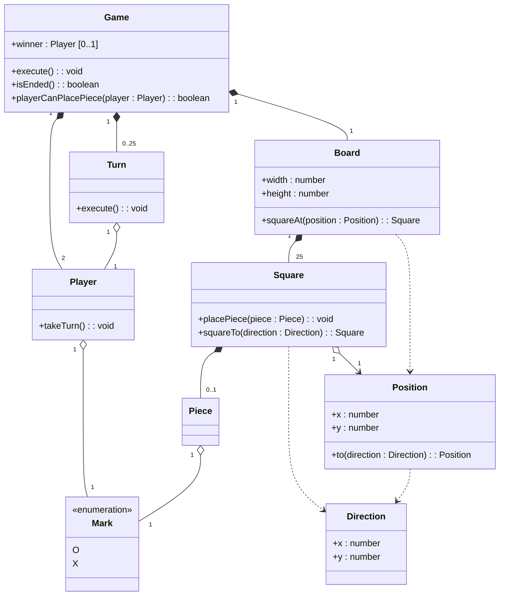

# 類別圖

## 物件導向分析類別圖

```mermaid
classDiagram
  class Game {
    +winner : Player [0..1]
    +execute(): void
    +isEnded(): boolean
    +playerCanPlacePiece(player : Player) : boolean
  }

  class Turn {
    +execute(): void
  }

  class Player {
    +takeTurn(): void
  }

  class Board {
    +width : number
    +height : number
    +squareAt(position : Position): Square
  }

  class Square {
    +placePiece(piece : Piece): void
    +squareTo(direction : Direction): Square
  }

  class Piece {
  }

  class Mark {
    <<enumeration>>
    O
    X
  }

  class Position {
    +x : number
    +y : number
    +to(direction : Direction): Position
  }

  class Direction {
    +x : number
    +y : number
  }

  Game "1" *-- "1" Board
  Game "1" *-- "2" Player
  Game "1" *-- "0..25" Turn
  Turn "1" o-- "1" Player
  Player "1" o-- "1" Mark
  Board "1" *-- "25" Square
  Square "1" *-- "0..1" Piece
  Square "1" o--> "1" Position
  Piece "1" o-- "1" Mark
  Board ..> Position
  Square ..> Direction
  Position ..> Direction
```
