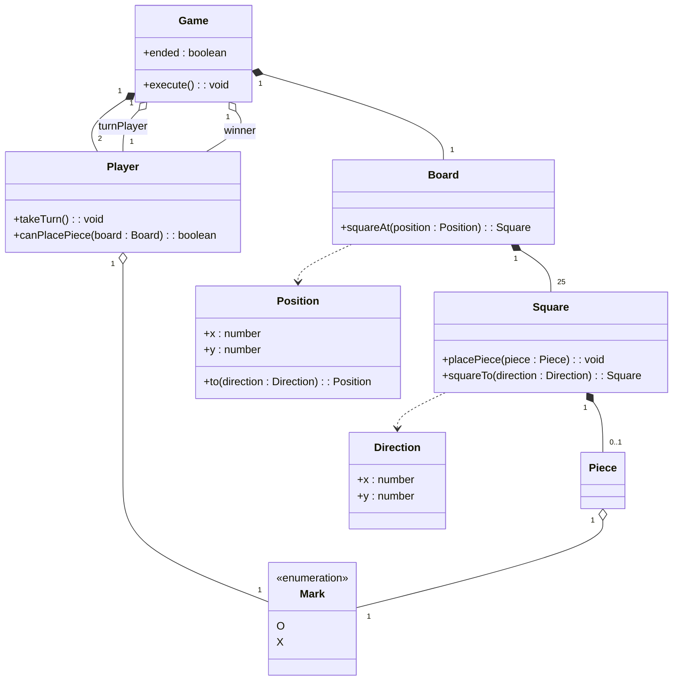

## 類別圖

```mermaid
classDiagram
  class Game {
    +ended : boolean
    +execute(): void
  }

  class Player {
    +takeTurn(): void
    +canPlacePiece(board : Board): boolean
  }

  class Board {
    +squareAt(position : Position): Square
  }

  class Square {
    +placePiece(piece : Piece): void
    +squareTo(direction : Direction): Square
  }

  class Piece {
  }

  class Mark {
    <<enumeration>>
    O
    X
  }

  class Position {
    +x : number
    +y : number
    +to(direction : Direction): Position
  }

  class Direction {
    +x : number
    +y : number
  }

  Game "1" *-- "1" Board
  Game "1" *-- "2" Player
  Game "1" o-- "1" Player: turnPlayer
  Game "1" o-- "0..1" Player: winner
  Player "1" o-- "1" Mark
  Board "1" *-- "25" Square
  Square "1" *-- "0..1" Piece
  Piece "1" o-- "1" Mark
  Board ..> Position
  Square ..> Direction
```
