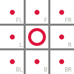

# relati 經典版

relati 是一個可以透過紙筆進行的回合制的棋盤遊戲，玩家將透過一系列的行動，逐步將對手逼至窮途末路，取得最後的勝利。

## 遊戲準備

- 玩家: 2 名
- 棋盤: 5 x 5 的方格棋盤
- 棋子: 在棋盤上能表示佔有一個格子的任何媒介，在紙上通常用筆在格子上標記 `圈圈 (O)` 和 `叉叉 (X)` 來表示

## 遊戲目標

玩家的目標是盡可能的壓縮對手可以下棋的範圍，最終使對手無法下棋以取得勝利。

## 遊戲流程

1. 決定玩家順序，先攻玩家使用 `圈圈 (O)`，後攻玩家使用 `叉叉 (X)`。
2. 當遊戲開始時，會由玩家輪流進行[回合](#玩家回合)。
3. 當玩家回合結束時：
   1. 有其他能下棋的玩家時，輪到該玩家進行[玩家回合](#玩家回合)。
   2. 僅剩回合玩家能繼續下棋時，回合玩家為贏家，遊戲結束。
   3. 無玩家能下棋時，沒有贏家，遊戲結束。

### 玩家回合

回合玩家下棋一次，依照[下棋規則](#下棋規則)，在棋盤上選擇格子，標記玩家使用的符號。

### 下棋規則

選擇格子標記符號時，該格子為空格且為[可連線的位置](#可連線的位置)。

### 可連線的位置

以下為棋盤一角：

我們以圈圈玩家為例，和中心的圈圈符號相鄰的八個點 (`F`、`B`、`L`、`R`、`FL`、`FR`、`BL`、`BR`) 皆為可連線的位置。

## 術語與名詞解釋

### 座標表示

從棋盤的左上角開始，為 `A1`，橫向依序為 `B1` 至 `E1`，直向依序為 `A2` 至 `A5`，依此類推，右下角為 `E5`。

### 方向表示

- `F` 為前方 (Front)
- `B` 為後方 (Back)
- `L` 為左方 (Left)
- `R` 為右方 (Right)
- `C` 為目前位置 (Current)，亦可看作中央 (Center)

### 連線

以下為棋盤一角：

兩枚我方符號只要垂直相鄰 (`F`、`B`)、水平相鄰 (`L`、`R`) 抑或對角線相鄰 (`FL`、`FR`、`BL`、`BR`) 皆視為連線。
